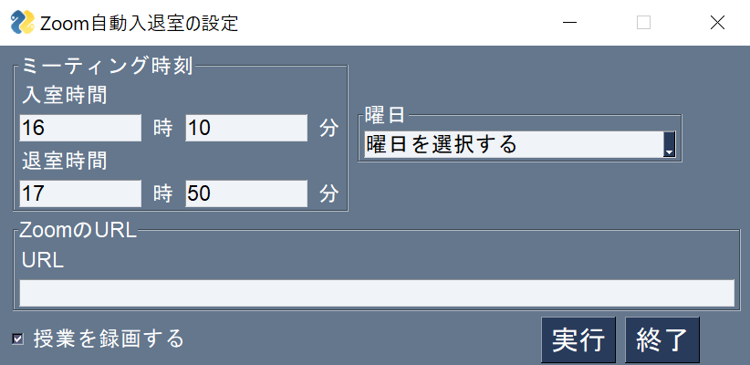

# auto_attend_zoom
zoomに自動で入室するプログラム

## 実行方法

```
python auto_attend_zoom.py
```

## 実行方法
- 手順
    1. 入退室の時刻を設定する
    2. 出席したい日付を入力する
    3. zoomのURLを入力する
    4. 録画をする場合チェックをする
    5. 実行ボタンを押す

|GUI操作|
|---|
||

## 事前準備
録画機能を使う場合、windowsの録画機能を使用するため、以下の画像のようにゲームバーの設定をオンにする

|ゲームバー設定|
|---|
||